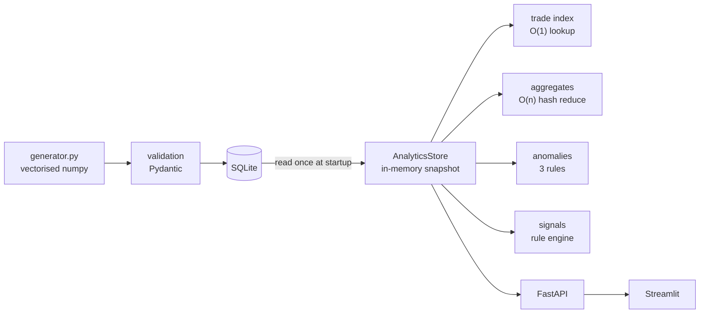

# TradeTrack Analytics Engine

A batch analytics service over synthetic trade/order logs: aggregate metrics,
explainable anomaly detection, rule-based signals, a REST API and a dashboard.

> **Data.** All trades are synthetic, generated by this repository. There is no
> market feed and no external data source.
>
> **Numbers.** Every figure in this README was produced by a script in this
> repository, on the machine noted in `benchmarks/results.md`. Nothing is
> estimated. Regenerate with `make bench` and `make eval`.
>
> **Signals.** The signal engine applies documented momentum and volume rules.
> There is no backtest and no profitability claim: the generator is a random walk
> with no learnable structure, so a positive backtest result would be measuring
> the random seed.

---

## Quick start

```bash
git clone <your-fork-url> && cd TradeTrack-Analytics-Engine

python3 -m venv .venv
.venv/bin/pip install -r requirements.txt

.venv/bin/python scripts/generate_data.py --rows 200000 --reset
.venv/bin/uvicorn tradetrack.api.main:app --app-dir src
```

Then, in a second terminal:

```bash
.venv/bin/streamlit run dashboard/app.py
```

| Service | URL |
|---|---|
| API | http://127.0.0.1:8000 |
| Interactive API docs | http://127.0.0.1:8000/docs |
| Dashboard | http://127.0.0.1:8501 |

`make help` lists every shortcut (`make install`, `make data`, `make api`,
`make dashboard`, `make test`, `make bench`, `make eval`, `make docker`).

### Docker

```bash
docker compose --profile seed run --rm seed   # one-shot: generate 200k trades
docker compose up --build                      # api on :8000, dashboard on :8501
```

---

## Architecture



The design decision that shapes everything: **all analytics are computed once at
snapshot build, never per request.** Requests slice or look up. `GET /metrics` is
an attribute read. The cost of that choice — the snapshot is point-in-time, and
new rows need a reload — is stated in `store.py` and revisited in
`docs/system_design.md`.

Full detail: **[docs/system_design.md](docs/system_design.md)**

---

## Features

- **Vectorised synthetic generator** — Poisson arrivals, Zipf-distributed symbol
  popularity, lognormal order sizes and latencies, with anomalies *deliberately
  injected* and recorded, so detector recall is measurable rather than asserted.
- **Validation at the boundary** — one Pydantic model validates at ingest and
  serialises at the API, so the two cannot drift. Bad rows are collected, not
  raised: one malformed record cannot abort a million-row load.
- **Explainable anomaly detection** — three rules, no model. Every finding carries
  the metric, the threshold it crossed, and a sentence explaining why.
- **Rule-based signals** — VWAP momentum with a volume-support condition.
  Descriptive, documented, and explicitly not predictive.
- **REST API** — eight endpoints, pagination, filtering, one error envelope,
  generated OpenAPI.
- **Benchmarks that separate complexity from runtime** — with the constant-factor
  wins labelled as such.

---

## Tech stack

| Layer | Choice | Why not the alternative |
|---|---|---|
| API | FastAPI + Pydantic | Validation lives in the routing layer, so a new route cannot forget the page cap |
| Data | pandas + numpy | Vectorised aggregation; the per-row cost happens in C |
| Storage | SQLite | Read-mostly, single-writer. Postgres would add a server, a pool and a network hop for nothing — see §7.4 |
| Dashboard | Streamlit | Reads the API over HTTP, which forces the API to be genuinely sufficient |
| Tests | pytest | 142 tests |
| Packaging | Docker + compose | Slim, not alpine: musl has no manylinux wheels for pandas/numpy |

**Deliberately absent:** Kafka, Redis, Celery, Kubernetes, Spark, and any ML
model. `docs/system_design.md` §7 gives each one a trigger condition and a stated
cost. An MVP that already contains all of them is not a design.

---

## API

| Method | Path | Description |
|---|---|---|
| GET | `/health` | Liveness, rows loaded, snapshot age and build cost |
| GET | `/trades` | Paged trades; filter by symbol, account, status, side, quantity, time |
| GET | `/trades/{trade_id}` | One trade — O(1) average hash lookup |
| GET | `/metrics` | Dataset summary: counts, failure rate, avg/p95/p99 latency, notional |
| GET | `/metrics/symbol/{symbol}` | Per-symbol aggregates including VWAP |
| GET | `/metrics/top` | Top-K symbols by `trade_count`, `notional`, `quantity`, `failure_rate` or `latency` |
| GET | `/anomalies` | Paged findings; filter by type, severity, symbol |
| GET | `/signals` | Paged signals; filter by action, confidence, symbol |

```bash
curl 'http://127.0.0.1:8000/health'
curl 'http://127.0.0.1:8000/metrics'
curl 'http://127.0.0.1:8000/trades?symbol=NVDA&status=REJECTED&limit=5'
curl 'http://127.0.0.1:8000/trades/T0000000042'
curl 'http://127.0.0.1:8000/metrics/top?sort_by=notional&k=5'
curl 'http://127.0.0.1:8000/anomalies?severity=CRITICAL&limit=3'
curl 'http://127.0.0.1:8000/signals?min_confidence=0.7'
```

Every error uses one envelope, so a client writes one error path:

```json
{ "error": "trade_not_found", "detail": "No trade with id 'NOPE' in the current snapshot." }
```

`404` unknown trade/symbol · `422` invalid query parameter · `503` no data loaded.
The last is deliberate: an unseeded deploy is an operator problem, and a `500`
would send someone hunting a crash that never happened.

---

## Complexity

| Operation | Time | Space | Where |
|---|---|---|---|
| Trade lookup by id | **O(1)** average | O(n) index | `algorithms.index_lookup` |
| Index build | O(n) | O(n) | `algorithms.build_index` |
| Aggregation by symbol | **O(n)** | O(g) groups | `algorithms.group_reduce` |
| Rolling failure rate | **O(n)** | O(w) window | `algorithms.sliding_window_failure_rate` |
| Top-K symbols | **O(n log k)** | O(k) | `algorithms.top_k` |
| Percentile | O(n log n) | O(n) | `algorithms.percentile` |
| Full snapshot build | O(n log n) | O(n) | `store.AnalyticsStore.build` |

Two honesty notes, because they are the kind of thing that gets overclaimed:

* Dict lookup is **O(1) average**, not worst case. Adversarial keys collide into O(n).
* `aggregate_by_symbol` is O(n + Σ m log m), not clean O(n) — exact p95 requires
  sorting each symbol's latencies. Drop p95 and it is O(n).

---

## Benchmarks

Method: fastest of 3 runs per case (minimum, not mean — the mean measures the
machine's background load as much as the code). Machine and full table in
[`benchmarks/results.md`](benchmarks/results.md); regenerate with `make bench`.

| Benchmark | n | Baseline | Optimised | Speedup | Kind of win |
|---|---|---|---|---|---|
| Trade lookup (worst case) | 200,000 | 6.72 ms scan | 23.4 ns hash | — | **Complexity**: O(n) → O(1) |
| Rolling failure rate (w=500) | 50,000 | 71.5 ms | 3.57 ms | 20.1x | **Complexity**: O(n·w) → O(n) |
| Top-10 by quantity | 200,000 | 19.8 ms sort | 14.1 ms heap | 1.4x | **Complexity**: O(n log n) → O(n log k) |
| Data generation | 100,000 | 815 ms loop | 50.9 ms numpy | 16.0x | **Constant factor** only |
| SQLite bulk insert | 20,000 | 4.84 s per-row | 113 ms one txn | 42.9x | **Constant factor** (fsync count) |

**Read these carefully.** Complexity is a property of an algorithm and transfers
to any machine. Runtime is a property of one machine on one day. The lookup row
has no speedup number on purpose: O(n) vs O(1) at n=200,000 produces a ratio near
300,000x, which is arithmetically true and rhetorically worthless without the n.
The useful statement is the absolute one — a scan costs milliseconds, a dict hit
costs nanoseconds.

Top-10 shows only 1.4x, and that is reported rather than hidden: at the API's real
input size (12 symbols) a plain sort would be entirely fine. The heap is there
because the group count is the dimension that grows.

---

## Anomaly detection

Three rules. Each has a documented guard against its own most likely false
positive — a detector that fires on everything is the same as one that fires on
nothing.

| Rule | Baseline | Threshold | False-positive guard |
|---|---|---|---|
| `HIGH_LATENCY` | dataset p99 | max(p99, 250ms) | The absolute floor. Every dataset *has* a p99, so a bare above-p99 rule alerts on 1% of a perfectly healthy venue |
| `HIGH_FAILURE_RATE` | global failure rate | p + 3·SE, SE per group size | Binomial standard error scaled to each group's own n, plus a 50-trade minimum |
| `UNUSUAL_QUANTITY` | per-symbol median of **log** size | median + 3.5·MAD·1.4826 | Log space, per symbol |

### Measured performance

Scored against the generator's injection ground truth, on **five held-out seeds**
never used for tuning. Full protocol in [`benchmarks/detector_eval.md`](benchmarks/detector_eval.md);
regenerate with `make eval`.

| Rule | Precision | Recall | F1 |
|---|---|---|---|
| `HIGH_LATENCY` | 1.000 | 0.997 | 0.999 |
| `HIGH_FAILURE_RATE` | 0.920 | 1.000 | 0.956 |
| `UNUSUAL_QUANTITY` | 0.909 | 0.864 | 0.886 |

### The bug worth reading about

The quantity rule originally applied median + k·MAD to **raw** order sizes. Scored
against ground truth it achieved 100% recall at **3.4% precision** — 2,267 alerts
for 78 real events. It was not mis-tuned; it was flagging the lognormal
distribution's entirely legitimate right tail, and no value of k fixes that
(k=10 still only reaches 13.6% precision).

Taking the log first turns a multiplicative tail into an additive one, which is
what makes a symmetric robust z-score valid. Same rule, same data, log space:
**90.9% precision at 86.4% recall.**

The threshold was chosen by an F1 sweep on one seed and then **frozen and
evaluated on five seeds it had never seen**, so the headline figures are held-out
numbers rather than tuned-to-fit ones. `tests/test_anomalies.py` contains a
regression test that fails if anyone reverts the rule to raw space.

---

## Testing

```bash
make test          # or: .venv/bin/python -m pytest
```

**142 tests**, covering validation, algorithms, aggregation, detection, signals,
persistence and the HTTP contract. Both normal and edge cases: empty inputs,
window larger than the dataset, k larger than n, zero-spread MAD, duplicate keys,
unorderable heap items, offset past the end, and every invalid query parameter.

Tests worth singling out, because they encode findings rather than just coverage:

* `test_both_paths_agree_exactly` — the pure-Python reference aggregation and the
  pandas fast path must produce identical output, so the fast path cannot drift.
* `test_log_space_beats_raw_space_on_precision` — fails if the quantity rule is
  ever "simplified" back to raw space.
* `test_falsy_accumulator_is_not_reinitialised` — guards a real bug class: `if not
  current` instead of `is None` silently resets any group whose running total is 0.
* `test_reloading_the_same_batch_is_idempotent` — the property that makes a failed
  load safe to re-run.
* `test_data_endpoints_return_503_not_500` — "no data" is an operator problem, not
  a crash.

---

## Project layout

```
src/tradetrack/
  models.py        Pydantic schemas - the one definition of a valid trade
  config.py        Environment-driven settings, all with working defaults
  algorithms.py    Pure primitives + their naive twins (the benchmark control arm)
  generator.py     Vectorised synthetic data with recorded anomaly injection
  processing.py    Validation, aggregation (reference + fast path), global metrics
  anomalies.py     Three explainable rules
  signals.py       VWAP momentum + volume rules
  db.py            SQLite schema, bulk load, read-back
  store.py         In-memory snapshot and every derived view
  api/
    main.py        Application factory + lifespan
    deps.py        Store handle and the pagination contract
    errors.py      One error envelope for every failure
    routers/       health, trades, signals, anomalies, metrics
dashboard/app.py   Streamlit, reads the API over HTTP
scripts/           generate_data.py, run_benchmarks.py, evaluate_detector.py
tests/             142 tests
docs/              system_design.md
benchmarks/        Generated results (results.md, detector_eval.md)
```

---

## Limitations

Stated plainly, because every one of these is a real gap:

- **Synthetic data only.** No real market data, and the generator has no learnable
  structure by construction.
- **Signals are not validated.** No backtest, no forward returns, no profitability
  claim of any kind.
- **Batch, not streaming.** New rows are invisible until the API restarts.
- **Single process.** The whole table lives in one worker's memory; this design is
  wrong past roughly 5-10M rows.
- **No authentication, rate limiting or retries.** Nothing to retry (no outbound
  calls), and auth is out of scope for a local analytics service.
- **No load testing.** There are per-operation benchmarks but no concurrent-request
  numbers, so claims about API latency *under load* are currently unmeasured.
- **Exact percentiles retain every observation** — O(n) memory purely for p95.

## Future improvements

In the order they would actually matter, each with its trigger:

1. **Load testing** — the largest gap between what is measured and what is claimed.
2. **Push filtering into SQL** when `GET /trades` p95 exceeds ~100ms.
3. **t-digest percentiles** when latency arrays dominate snapshot memory.
4. **`ETag`/`Cache-Control`** when repeated identical reads dominate the request mix.
5. **Shared snapshot (Redis)** at more than one replica — and not before, since it
   is a net loss at one.
6. **Streaming ingest**, which requires incremental aggregates and rolling anomaly
   baselines. The hard part is semantics, not code volume.

Each is expanded with its cost and tradeoff in
[docs/system_design.md §7](docs/system_design.md).

## License

MIT.
