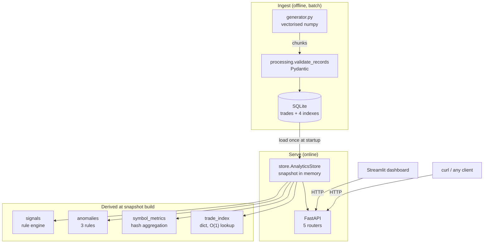
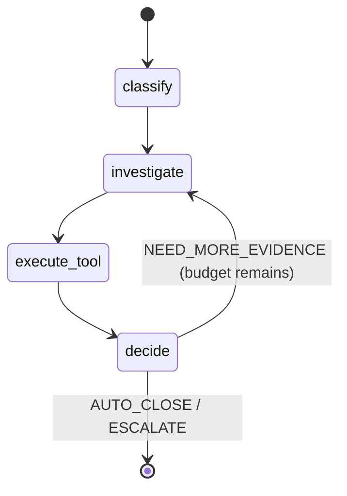
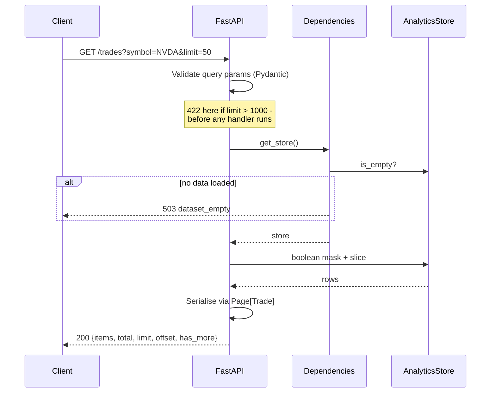

# System design

This document describes what the system **is**, and separately what it would
**become** under load. The two are kept apart on purpose: an MVP that already
contains Kafka, Redis and a sharded database is not a design, it is a costume.

Everything in "Today" is code you can read in this repository. Everything in
"Under load" is a proposal with a stated trigger and a stated cost.

---

## 1. Architecture

## 2. Component responsibilities

| Component | Owns | Explicitly does not own |
|---|---|---|
| `generator.py` | Producing synthetic trades and recording injected anomalies | Persistence, validation |
| `models.py` | Every schema; the one definition of a valid trade | Any business logic |
| `processing.py` | Validation, aggregation, the definition of "failure" | Detection, serving |
| `algorithms.py` | Pure algorithmic primitives and their naive twins | Any domain knowledge |
| `anomalies.py` | The three detection rules and their thresholds | Alerting, notification |
| `signals.py` | The momentum/volume rule set | Any claim about profitability |
| `db.py` | SQLite schema, bulk load, read-back | Query logic beyond `SELECT *` |
| `store.py` | The in-memory snapshot and all derived views | HTTP |
| `api/` | HTTP surface, validation, error mapping, pagination | Analytics |
| `agents/` | Triaging what the detector found: classify, gather evidence, decide | Detection itself |
| `dashboard/` | Presentation only; talks to the API over HTTP | Direct data access |

The dependency direction is strictly one-way: `api -> store -> processing/anomalies/signals -> algorithms/models`.
Nothing lower imports anything higher, so every layer is testable alone.

### 2a. The agent layer

The detector and the agent answer different questions, and keeping them separate
is the main design decision here:

* **Detector** — *is this anomalous?* Deterministic, exhaustive, runs over every
  row, measured against ground truth. No model.
* **Agent** — *what should be done about this one, and why?* Non-deterministic,
  runs only over what the detector surfaced, and produces a justification.

Putting the LLM in the detector would have been the obvious move and the wrong
one: it would make an exhaustive O(n) scan cost an API call per row, and it would
make the precision/recall numbers depend on a model version. The agent runs over
hundreds of findings, not millions of rows.

Four decisions worth defending:

1. **Every tool takes one string and returns one sentence.** Multi-argument tool
   calls are where small models most often produce malformed JSON. Collapsing the
   signature removes that failure mode instead of retrying around it.
2. **Tools never raise.** An unknown symbol returns "no data". A raising tool ends
   the run; a tool that reports absence lets the agent reason about it and try
   something else.
3. **The loop is bounded, and exhaustion escalates.** Defaulting to AUTO_CLOSE on
   a budget overrun would make the failure mode silent, which is the worst
   property an alerting system can have.
4. **A hallucinated tool name is recorded as evidence, not raised.** Telling the
   model its call was invalid lets the next iteration self-correct, and keeps the
   failure visible in the audit trail.

**What is not here:** no persistent agent memory, no multi-agent negotiation, no
human-in-the-loop interrupt, no streaming. LangGraph supports all four. None is
load-bearing for single-anomaly triage, and each would need its own evaluation.

## 3. Request flow

`GET /trades/{id}` is the same flow with the mask replaced by one dict lookup.

## 4. Data flow

1. `generate()` produces a chunk as a DataFrame (vectorised, O(n)).
2. `scripts/generate_data.py` rewrites `trade_id` so ids stay unique across chunks.
3. `db.insert_frame` writes the chunk in one transaction (`INSERT OR REPLACE`, idempotent).
4. On API startup `AnalyticsStore.from_sqlite` reads the whole table once.
5. `AnalyticsStore.build` sorts by timestamp and computes every derived view once.
6. Requests read the snapshot. **No request recomputes analytics.**

The consequence, stated plainly: the snapshot is immutable for the process
lifetime. New rows require a restart. That is correct for batch analytics and
wrong for anything live - see §8.

## 5. API design

| Endpoint | Returns | Cost per request |
|---|---|---|
| `GET /health` | Liveness + snapshot state | O(1) |
| `GET /trades` | Paged, filtered trades | O(n) mask over the snapshot |
| `GET /trades/{id}` | One trade | O(1) average |
| `GET /metrics` | Dataset summary | O(1), precomputed |
| `GET /metrics/symbol/{s}` | One symbol's aggregates | O(1) average |
| `GET /metrics/top` | Top-K symbols | O(g log k) over g symbols |
| `GET /anomalies` | Paged findings | O(a) filter |
| `GET /signals` | Paged signals | O(s) filter |

Conventions that are enforced rather than documented-and-hoped-for:

* **One error envelope.** `{"error": code, "detail": message}` for 404, 422 and
  503 alike, so a client writes one error path.
* **`limit` capped in the query constraint**, not in handler code. A new route
  cannot forget the cap because it comes from the shared dependency.
* **`total` is pre-pagination**, so a client can size a pager without walking it.
* **`sort_by` indexes an allow-list.** Never `getattr(obj, user_string)` -
  that is an injection primitive, and `?sort_by=__class__` is the proof.
* **503 for "no data", not 500.** An unseeded deploy is an operator problem;
  returning 500 sends someone hunting a crash that never happened.

## 6. Bottlenecks

Measured or derived, in the order they actually bite:

| # | Bottleneck | Bites at | Symptom |
|---|---|---|---|
| 1 | Whole table loaded into one process's RAM | ~5-10M rows | Startup RSS; eventually OOM |
| 2 | `GET /trades` filters with an O(n) mask | ~1M rows | Request latency grows linearly |
| 3 | Snapshot rebuild is single-threaded | ~5M rows | Slow, blocking restarts |
| 4 | Exact percentiles retain every latency | ~10M rows | O(n) memory just for p95 |
| 5 | Python GIL bounds one worker to one core | high concurrency | CPU-bound requests queue |
| 6 | Agent latency is one LLM round trip per node | interactive use | Triage is seconds, not milliseconds |

At the tested 200k rows none of #1-#5 are active: snapshot build is 0.19s and
requests are single-digit milliseconds. That is the point of listing the trigger
next to the bottleneck.

**Bottleneck #1 is now measured rather than estimated.** `benchmarks/scale_profile.md`:
snapshot build is 0.19s / 228 MB at 200k rows and 6.68s / 1,872 MB at 5M. Build
time grows close to linearly, so *time* is not the constraint — memory is, and
because each worker holds its own snapshot, memory is also what caps worker count.
That measurement is what makes §7.1 and §7.3 supported rather than merely plausible.

**Bottleneck #6 is why triage is a batch job, not a request path.** Each anomaly
costs at least three sequential LLM calls. Putting that behind a synchronous HTTP
endpoint would give a multi-second p95; it belongs on a queue with results written
back, which is the one piece of infrastructure this design would genuinely need
before production.

## 7. Scaling: why / what / tradeoff

Each of these is deliberately **not** implemented. The trigger column is the
condition under which implementing it stops being premature.

### 7.1 Push filtering into SQL

* **Why** — bottleneck #2: masking a million-row frame per request is wasteful when
  four indexes already exist.
* **What** — `GET /trades` becomes a parameterised `SELECT ... WHERE ... LIMIT ... OFFSET`.
* **Tradeoff** — a query round-trip per request instead of a memory slice, and the
  filter logic now lives in two languages. Below ~1M rows the in-memory mask is
  genuinely faster.
* **Trigger** — p95 on `GET /trades` exceeds ~100ms.

### 7.2 Cache computed responses

* **Why** — `/metrics` and `/anomalies` are identical for every caller between snapshots.
* **What** — the snapshot **is already the cache**; the next step is an HTTP cache
  (`ETag` from `loaded_at`, `Cache-Control`) so clients skip the round trip entirely.
* **Tradeoff** — staleness becomes explicit and must be communicated, and a
  cross-process cache adds an invalidation path that can be wrong.
* **Trigger** — repeated identical reads dominating the request mix.

### 7.3 Redis

* **Why** — with more than one API replica, each holds its own snapshot: N copies of
  the same data, N rebuilds, and answers that can differ between replicas.
* **What** — build the snapshot once in a worker, publish derived views to Redis,
  and have replicas read from it.
* **Tradeoff** — a new stateful dependency, a serialisation cost that can exceed the
  compute it saves, and a network hop replacing a pointer dereference. **This is a
  net loss at a single replica**, which is exactly why it is not here.
* **Trigger** — more than one replica, or snapshot rebuild too expensive to repeat.

### 7.4 PostgreSQL

* **Why** — SQLite has one writer. Concurrent ingest, or ingest during serving, serialises.
* **What** — Postgres with a connection pool; `BRIN` on `timestamp` for an append-only
  table, partial indexes for the failure statuses.
* **Tradeoff** — a server process, a pool, backups, migrations, and a network hop on
  every query. For a read-mostly single-writer workload this buys nothing.
* **Trigger** — concurrent writers, >100GB, or a second service needing the same data.

### 7.5 Horizontal scaling

* **Why** — the GIL caps one process at one core.
* **What** — the API is already stateless per request (all state is the snapshot),
  so N replicas behind a load balancer need no code change. `uvicorn --workers N`
  gets most of it on one box.
* **Tradeoff** — N x memory, since each worker holds its own snapshot. Memory, not
  CPU, is what limits worker count here.
* **Trigger** — sustained CPU saturation on a single worker.

### 7.6 Approximate percentiles

* **Why** — bottleneck #4: exact p95 requires retaining every observation.
* **What** — t-digest or HdrHistogram: bounded memory, mergeable across shards,
  typically <1% quantile error.
* **Tradeoff** — the number stops being exact, and "approximately p95" needs
  explaining to whoever reads the dashboard.
* **Trigger** — latency arrays dominating snapshot memory.

### 7.7 PySpark

* **Why** — when a dataset no longer fits one machine at all.
* **What** — the aggregation is already a `group_reduce`, which is literally a
  map-side combine; porting it to Spark is close to mechanical.
* **Tradeoff** — JVM startup, shuffle costs, and a cluster to operate. Spark on
  10M rows is **slower** than pandas on one machine, not faster. Below roughly
  50-100GB it is the wrong tool.
* **Trigger** — the data genuinely exceeds one machine's memory.

## 8. Batch vs streaming

Today the system is unambiguously **batch**: load, snapshot, serve, restart to refresh.

Streaming would change three things, and they are worth naming because each is a real cost:

1. **Aggregates must become incremental.** Counts and sums update in O(1); exact
   percentiles cannot, which forces §7.6.
2. **Windows become time-based, not count-based.** `sliding_window_failure_rate`
   already has the right shape - a running sum over a bounded window - which is
   why that function exists in a batch system.
3. **The anomaly baselines have to move.** Today's rules compare against the whole
   dataset. Streaming needs a rolling baseline, and then late-arriving data can
   retroactively change whether something was an anomaly.

The honest summary: rules 1 and 3 are the hard parts, and neither is a code-volume
problem. They are semantics problems.

## 9. Failure scenarios

| Failure | Today's behaviour | Would need |
|---|---|---|
| Database file missing | Empty store; `/health` degraded, data routes 503 | Nothing - correct as is |
| Malformed rows at ingest | Collected in `ValidationReport`, batch continues | A dead-letter queue and a rejection-rate alert |
| Load interrupted halfway | Safe: `INSERT OR REPLACE` makes re-running idempotent | Nothing - correct as is |
| Unknown trade id / symbol | 404 with the shared error shape | Nothing |
| Client requests a huge page | 422 from the query constraint | Nothing |
| API down | Dashboard shows a start command, does not traceback | Retry with backoff |
| Snapshot rebuild fails | Startup fails loudly rather than serving wrong data | Serve the previous snapshot |
| Disk full during load | SQLite raises; transaction rolls back | Preflight free-space check |

**Idempotency** is worth calling out because it is the one production property the
MVP genuinely has: `trade_id` is the primary key and every insert is
`INSERT OR REPLACE`. A retried, duplicated or half-finished load converges to the
same table. That is what makes the loader safe to just re-run, and it is why
there is no "did it finish?" bookkeeping anywhere in the code.

**Not present:** retries with backoff, rate limiting, circuit breaking,
structured request logging, distributed tracing, auth. Each is a genuine
production requirement and none of them is load-bearing for a single-node batch
analytics service.

Two of those are worth a sentence, because their absence is a design decision
rather than an omission. **Retries** have nothing to retry: there are no outbound
calls and SQLite is local, so retry logic here would be cargo-culting. When they
do become necessary they need exponential backoff with jitter (jitter
specifically, so retrying clients do not synchronise into a thundering herd), a
retry budget so retries cannot amplify an outage, and application only to
idempotent operations. **Rate limiting** is absent, but a related protection is
not: `limit` is capped at 1,000 by the query constraint, so no single request can
ask for the whole table. That is request-size limiting, not rate limiting, and
the two should not be conflated.
